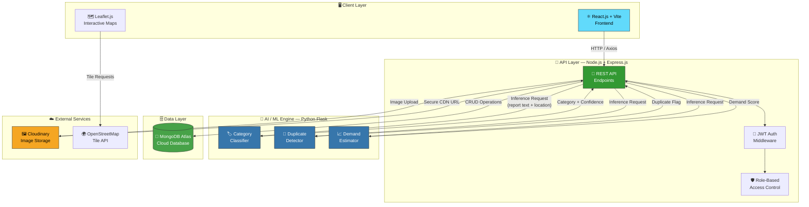
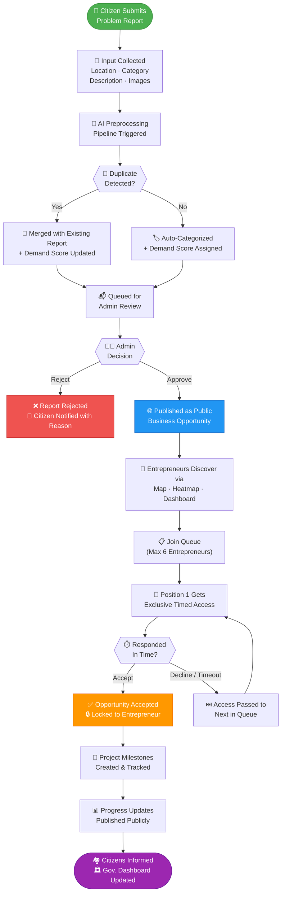
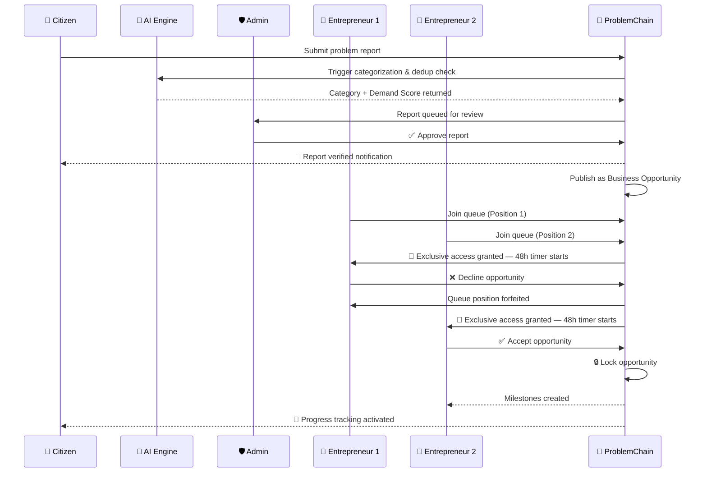
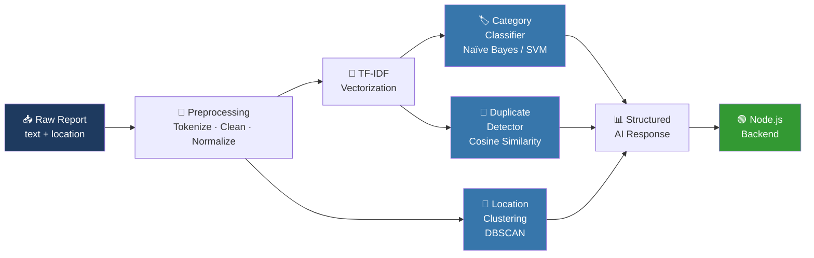

<div align="center">


# 🔗 ProblemChain

### *Transforming Verified Local Problems into Startup Opportunities*

[](LICENSE)
[](https://reactjs.org/)
[](https://nodejs.org/)
[](https://mongodb.com/)
[](https://python.org/)
[](https://tailwindcss.com/)
[](../../pulls)
[](https://github.com/your-username/ProblemChain)

<br/>

[🌐 Live Demo](#-demo) &nbsp;•&nbsp; [📖 API Docs](#-api-documentation) &nbsp;•&nbsp; [🐛 Report Bug](../../issues/new) &nbsp;•&nbsp; [💡 Request Feature](../../issues/new)

</div>

---

## 📋 Table of Contents

- [About the Project](#-about-the-project)
- [Problem Statement](#-problem-statement)
- [Our Solution](#-our-solution)
- [Key Features](#-key-features)
- [Tech Stack](#️-tech-stack)
- [System Architecture](#️-system-architecture)
- [Detailed Workflow](#-detailed-workflow)
- [Folder Structure](#-folder-structure)
- [Installation & Setup](#️-installation--setup)
- [API Documentation](#-api-documentation)
- [Database Schema](#️-database-schema)
- [AI/ML Workflow](#-aiml-workflow)
- [Security Measures](#-security-measures)
- [Testing & Performance](#-testing--performance)
- [Challenges & Future Scope](#-challenges--future-scope)
- [Demo](#-demo)
- [Team](#-team)
- [License](#-license)
- [References](#-references)

---

## 🧩 About the Project

**ProblemChain** is an AI-powered, community-driven platform that bridges the gap between unresolved local community needs and entrepreneurial market opportunities. Citizens report hyperlocal infrastructure problems, an AI engine verifies, categorizes, and scores them, and entrepreneurs discover data-backed startup opportunities — all within a single transparent and fair ecosystem.

> 💡 *"Where community problems become business opportunities."*

---

## 🔍 Problem Statement

Across cities and rural communities, residents face persistent unmet local needs — absent pharmacies, missing grocery stores, no EV charging stations, lacking educational services, and more. These problems remain unresolved because there is no centralized, data-driven platform to collect, validate, and prioritize them.

At the same time, entrepreneurs waste significant time and money conducting market research to identify viable investment locations. Existing platforms — reviews, complaints forums, social media — capture dissatisfaction but never convert verified community demand into actionable business opportunities.

| Root Cause | Downstream Impact |
|---|---|
| No centralized problem collection platform | Issues stay siloed and unaddressed |
| Entrepreneurs lack verified demand data | Capital flows to the wrong locations |
| Review platforms don't convert demand → opportunity | Market gaps persist indefinitely |
| Poor government resource allocation | Infrastructure deficits compound over time |

---

## 💡 Our Solution

ProblemChain creates a **transparent, AI-driven pipeline** from community pain to entrepreneurial gain:

```
Citizens Report  →  AI Verifies  →  Admins Approve  →  Entrepreneurs Discover  →  Community Benefits
```

The platform combines **AI-assisted verification**, **transparent queue-based allocation**, **real-time notifications**, **progress tracking**, and **government analytics** — creating a trusted ecosystem where every verified need becomes a sustainable, data-backed startup opportunity.

---

## ✨ Key Features

### 👥 For Citizens
- 📍 **Location-Based Problem Reporting** — Submit issues with GPS coordinates, category, description, and photo evidence
- 🔔 **Real-Time Progress Notifications** — Get notified when an entrepreneur claims and acts on your report
- 📊 **Transparent Lifecycle Tracking** — Follow every report from submission → verification → opportunity → resolution

### 🤖 For the AI Engine
- 🏷️ **Automatic Categorization** — Classifies reports into Healthcare, Transport, Education, Food & Grocery, Utilities, and more
- 🔁 **Intelligent Duplicate Detection** — Merges similar nearby reports to strengthen demand signals
- 📈 **Demand Scoring** — Scores business viability (0–100) based on report density, recency, and geographic factors

### 🛡️ For Administrators
- ✅ **Verification Dashboard** — Review, approve, or reject citizen reports before publication
- 📌 **Moderation Controls** — Manage categories, flag spam, and maintain platform integrity
- 🔔 **AI-Assisted Moderation** — AI pre-screens reports to reduce manual review load

### 💼 For Entrepreneurs
- 🗺️ **Interactive Opportunity Map** — Explore verified opportunities on a live Leaflet.js + OpenStreetMap interface
- 🌡️ **Demand Heatmaps** — Visualize high-demand zones with intensity overlays
- 🔍 **Smart Filters & Analytics** — Filter by category, region, demand score, and queue availability
- ⏳ **Fair Queue-Based Allocation** — Max 6 entrepreneurs per opportunity; first-in-queue receives exclusive timed access
- 🔒 **Opportunity Locking** — Once accepted, the opportunity locks and project milestones begin

### 🏛️ For Government
- 📊 **Regional Analytics Dashboard** — View aggregated demand patterns and infrastructure gap maps
- 🗂️ **Data-Driven Policy Insights** — Export reports to inform urban planning and resource allocation

---

## 🛠️ Tech Stack

<div align="center">

| Category | Technology | Purpose |
|---|---|---|
| **Frontend** | React.js, Vite, HTML5, CSS3, JavaScript | Web application & user interface |
| **UI Framework** | Tailwind CSS | Responsive, modern utility-first UI design |
| **Maps & Location** | Leaflet.js + OpenStreetMap | Interactive problem maps & demand heatmaps |
| **Backend** | Node.js, Express.js | REST API server & business logic |
| **Database** | MongoDB, Mongoose | Users, reports, opportunities, analytics storage |
| **AI / ML** | Python, Scikit-learn, Pandas, NumPy | Report categorization, duplicate detection, demand estimation |
| **Authentication** | JWT (JSON Web Tokens), bcrypt | Secure stateless auth & password hashing |
| **Image Storage** | Cloudinary | Secure cloud image upload & delivery |
| **Version Control** | Git, GitHub | Source code management & team collaboration |
| **API Testing** | Postman | Manual endpoint testing & collection sharing |
| **Automated Testing** | Jest, Supertest | Unit tests & API integration tests |
| **Deployment** | Vercel (Frontend), Render (Backend), MongoDB Atlas | Cloud hosting |
| **Documentation** | Markdown, Google Docs, Canva / PowerPoint | Docs & presentation |
| **Project Management** | GitHub Projects, GitHub Issues | Task tracking & sprint planning |

</div>

---

## 🏗️ System Architecture



---

## 🔄 Detailed Workflow

### End-to-End Platform Flow



### Queue Allocation Sequence



---

## 📁 Folder Structure

```
ProblemChain/
│
├── 📂 client/                           # ⚛️  React.js Frontend (Vite)
│   ├── public/
│   │   └── favicon.ico
│   ├── src/
│   │   ├── 📂 assets/                   # Images, icons, SVGs, fonts
│   │   ├── 📂 components/               # Reusable UI components
│   │   │   ├── Navbar.jsx
│   │   │   ├── Footer.jsx
│   │   │   ├── MapView.jsx              # Leaflet.js map wrapper
│   │   │   ├── HeatMap.jsx              # Demand heatmap overlay
│   │   │   ├── OpportunityCard.jsx
│   │   │   ├── QueueTracker.jsx
│   │   │   ├── ReportForm.jsx
│   │   │   └── MilestoneTimeline.jsx
│   │   ├── 📂 pages/                    # Route-level page components
│   │   │   ├── Home.jsx
│   │   │   ├── Dashboard.jsx
│   │   │   ├── Opportunities.jsx
│   │   │   ├── ReportProblem.jsx
│   │   │   ├── AdminPanel.jsx
│   │   │   └── GovernmentView.jsx
│   │   ├── 📂 context/                  # React Context (Auth, Theme)
│   │   │   ├── AuthContext.jsx
│   │   │   └── ThemeContext.jsx
│   │   ├── 📂 hooks/                    # Custom React hooks
│   │   │   ├── useAuth.js
│   │   │   └── useQueue.js
│   │   ├── 📂 services/                 # Axios API wrappers
│   │   │   ├── api.js
│   │   │   ├── reportService.js
│   │   │   └── opportunityService.js
│   │   └── 📂 utils/                    # Shared helpers
│   │       ├── formatDate.js
│   │       └── mapUtils.js
│   ├── index.html
│   ├── vite.config.js
│   ├── tailwind.config.js
│   └── package.json
│
├── 📂 server/                           # 🟢 Node.js + Express.js Backend
│   ├── 📂 config/
│   │   ├── db.js                        # MongoDB Atlas connection
│   │   └── cloudinary.js               # Cloudinary SDK config
│   ├── 📂 controllers/
│   │   ├── authController.js
│   │   ├── reportController.js
│   │   ├── opportunityController.js
│   │   ├── milestoneController.js
│   │   └── analyticsController.js
│   ├── 📂 middleware/
│   │   ├── authMiddleware.js            # JWT token verification
│   │   ├── roleMiddleware.js            # Role-based access guard
│   │   ├── uploadMiddleware.js          # Multer + Cloudinary upload
│   │   ├── rateLimiter.js              # express-rate-limit config
│   │   └── validateRequest.js          # express-validator schemas
│   ├── 📂 models/
│   │   ├── User.js
│   │   ├── Report.js
│   │   ├── Opportunity.js
│   │   └── Milestone.js
│   ├── 📂 routes/
│   │   ├── authRoutes.js
│   │   ├── reportRoutes.js
│   │   ├── opportunityRoutes.js
│   │   ├── milestoneRoutes.js
│   │   └── analyticsRoutes.js
│   ├── 📂 utils/
│   │   ├── notifications.js
│   │   ├── queueManager.js             # Queue allocation logic
│   │   └── aiClient.js                 # HTTP client for AI Engine
│   ├── .env.example
│   ├── server.js
│   └── package.json
│
├── 📂 ai-engine/                        # 🐍 Python AI/ML Service (Flask)
│   ├── 📂 models/
│   │   ├── category_classifier.pkl      # Trained Naive Bayes / SVM model
│   │   └── tfidf_vectorizer.pkl        # Fitted TF-IDF vectorizer
│   ├── 📂 scripts/
│   │   ├── preprocess.py               # Text cleaning & normalization
│   │   ├── train.py                    # Model training script
│   │   └── predict.py                  # Inference entrypoint
│   ├── 📂 data/
│   │   └── training_data.csv           # Labeled training dataset
│   ├── app.py                          # Flask REST API server
│   ├── requirements.txt
│   └── README.md
│
├── 📂 testing/                          # 🧪 QA & Tests
│   ├── 📂 unit/                         # Jest unit tests
│   │   ├── auth.test.js
│   │   └── report.test.js
│   ├── 📂 integration/                  # Supertest API tests
│   │   ├── auth.api.test.js
│   │   └── opportunity.api.test.js
│   └── 📂 postman/
│       └── ProblemChain.postman_collection.json
│
├── 📂 docs/                             # 📄 Documentation
│   ├── 📂 api/                          # API reference (Markdown)
│   ├── 📂 architecture/                 # Diagrams & decision docs
│   └── user-guide.md
│
├── 📂 .github/
│   ├── 📂 workflows/
│   │   └── ci.yml                       # GitHub Actions CI pipeline
│   └── PULL_REQUEST_TEMPLATE.md
│
├── .gitignore
├── README.md
└── LICENSE
```

---

## ⚙️ Installation & Setup

### Prerequisites

| Tool | Minimum Version | Download |
|---|---|---|
| Node.js | ≥ 18.x | [nodejs.org](https://nodejs.org/) |
| npm | ≥ 9.x | Included with Node.js |
| Python | ≥ 3.10 | [python.org](https://python.org/) |
| Git | Latest | [git-scm.com](https://git-scm.com/) |
| MongoDB Atlas | Cloud account | [mongodb.com/atlas](https://www.mongodb.com/atlas) |
| Cloudinary | Free account | [cloudinary.com](https://cloudinary.com/) |

---

### 1️⃣ Clone the Repository

```bash
git clone https://github.com/your-username/ProblemChain.git
cd ProblemChain
```

---

### 2️⃣ Backend Setup

```bash
cd server
npm install
cp .env.example .env
```

Edit `.env` with your credentials:

```env
# ── Server ──────────────────────────────────────
PORT=5000
NODE_ENV=development

# ── MongoDB ─────────────────────────────────────
MONGODB_URI=mongodb+srv://<user>:<password>@cluster.mongodb.net/problemchain

# ── JWT ─────────────────────────────────────────
JWT_SECRET=your_super_secret_key_here
JWT_EXPIRES_IN=7d

# ── Cloudinary ──────────────────────────────────
CLOUDINARY_CLOUD_NAME=your_cloud_name
CLOUDINARY_API_KEY=your_api_key
CLOUDINARY_API_SECRET=your_api_secret

# ── AI Engine ───────────────────────────────────
AI_ENGINE_URL=http://localhost:8000
```

```bash
# Start backend (development with nodemon)
npm run dev
# ✅ Server running at http://localhost:5000
```

---

### 3️⃣ Frontend Setup

```bash
cd ../client
npm install
cp .env.example .env
```

Edit `.env`:

```env
VITE_API_BASE_URL=http://localhost:5000/api
VITE_MAP_TILE_URL=https://{s}.tile.openstreetmap.org/{z}/{x}/{y}.png
```

```bash
npm run dev
# ✅ App running at http://localhost:5173
```

---

### 4️⃣ AI/ML Engine Setup

```bash
cd ../ai-engine
python -m venv venv

# Activate virtual environment
source venv/bin/activate          # macOS / Linux
venv\Scripts\activate             # Windows

pip install -r requirements.txt

# First-time: train the models
python scripts/train.py

# Start Flask API
python app.py
# ✅ AI service running at http://localhost:8000
```

---

### 5️⃣ Branch Guide

> Each team member works on a dedicated branch. All merges to `main` go through pull request review by the Team Lead.

| Branch | Owner | Responsibility |
|---|---|---|
| `main` | Saravana | Production-ready, merged & reviewed code |
| `aiml` | Saravana | AI/ML model development |
| `backend` | Manoj | REST APIs, authentication, business logic |
| `frontend` | Dharani | UI components and API integration |
| `testing` | Ronald | Jest/Supertest tests and QA |
| `research` | Sabarish | Architecture, scalability, research |
| `docs` | Aaseef | README, documentation, presentation |

---

## 📡 API Documentation

**Base URL:** `http://localhost:5000/api`  
**Auth Header:** `Authorization: Bearer <jwt_token>` *(required on protected routes)*

---

### 🔐 Authentication

| Method | Endpoint | Description | Auth |
|---|---|---|:---:|
| `POST` | `/auth/register` | Register a new user | ❌ |
| `POST` | `/auth/login` | Login and receive JWT token | ❌ |
| `GET` | `/auth/profile` | Get authenticated user's profile | ✅ |
| `PATCH` | `/auth/profile` | Update profile details | ✅ |

<details>
<summary><b>POST /auth/register — Request & Response</b></summary>

**Request Body:**
```json
{
  "name": "Arjun Kumar",
  "email": "arjun@example.com",
  "password": "SecurePass123!",
  "role": "citizen"
}
```
`role` accepts: `citizen` | `entrepreneur` | `government`

**Response `201 Created`:**
```json
{
  "success": true,
  "message": "User registered successfully",
  "token": "eyJhbGciOiJIUzI1NiIsInR5cCI6IkpXVCJ9...",
  "user": {
    "_id": "64f1abc123...",
    "name": "Arjun Kumar",
    "email": "arjun@example.com",
    "role": "citizen",
    "createdAt": "2025-04-01T10:00:00.000Z"
  }
}
```
</details>

---

### 📝 Problem Reports

| Method | Endpoint | Description | Auth |
|---|---|---|:---:|
| `GET` | `/reports` | Get all approved reports (paginated) | ❌ |
| `POST` | `/reports` | Submit a new problem report | ✅ |
| `GET` | `/reports/:id` | Get a single report by ID | ❌ |
| `PATCH` | `/reports/:id/verify` | Admin: approve or reject a report | ✅ Admin |
| `DELETE` | `/reports/:id` | Admin: delete a report | ✅ Admin |

<details>
<summary><b>POST /reports — Request & Response</b></summary>

**Content-Type:** `multipart/form-data`

```json
{
  "title": "No pharmacy within 10 km",
  "category": "Healthcare",
  "description": "Residents in this ward travel over 10 km to access medicine. Two pharmacies closed last year.",
  "location": {
    "lat": 13.0827,
    "lng": 80.2707,
    "address": "Ward 7, Chennai, Tamil Nadu"
  },
  "images": "<file_upload>"
}
```

**Response `201 Created`:**
```json
{
  "success": true,
  "report": {
    "_id": "64f2bcd456...",
    "title": "No pharmacy within 10 km",
    "status": "pending",
    "aiMetadata": {
      "category": "Healthcare",
      "demandScore": 74,
      "confidence": 0.91,
      "duplicateOf": null
    },
    "createdAt": "2025-04-01T10:30:00.000Z"
  }
}
```
</details>

---

### 💼 Opportunities

| Method | Endpoint | Description | Auth |
|---|---|---|:---:|
| `GET` | `/opportunities` | List all published opportunities | ❌ |
| `GET` | `/opportunities/:id` | Get opportunity details + queue info | ❌ |
| `POST` | `/opportunities/:id/queue` | Join the entrepreneur queue | ✅ Entrepreneur |
| `PATCH` | `/opportunities/:id/accept` | Accept the opportunity (when active in queue) | ✅ Entrepreneur |
| `PATCH` | `/opportunities/:id/decline` | Decline the opportunity | ✅ Entrepreneur |
| `GET` | `/opportunities/:id/milestones` | Get linked project milestones | ✅ |

<details>
<summary><b>GET /opportunities/:id — Response</b></summary>

```json
{
  "success": true,
  "opportunity": {
    "_id": "64f3def789...",
    "title": "No pharmacy within 10 km — Ward 7, Chennai",
    "category": "Healthcare",
    "demandScore": 74,
    "location": { "lat": 13.0827, "lng": 80.2707 },
    "status": "open",
    "queue": [
      {
        "entrepreneurId": "64f4abc...",
        "position": 1,
        "status": "active",
        "expiresAt": "2025-04-03T10:00:00.000Z"
      },
      {
        "entrepreneurId": "64f5xyz...",
        "position": 2,
        "status": "waiting"
      }
    ],
    "queueLength": 2,
    "maxQueueSize": 6
  }
}
```
</details>

---

### 📊 Analytics

| Method | Endpoint | Description | Auth |
|---|---|---|:---:|
| `GET` | `/analytics/heatmap` | GeoJSON heatmap data by demand score | ❌ |
| `GET` | `/analytics/dashboard` | Platform-wide stats (reports, conversions) | ✅ Admin |
| `GET` | `/analytics/government` | Regional demand breakdown by category | ✅ Government |

---

## 🗃️ Database Schema

### User

```javascript
{
  _id:           ObjectId,
  name:          String,
  email:         { type: String, unique: true, lowercase: true },
  passwordHash:  String,                           // bcrypt hashed
  role:          { enum: ["citizen", "entrepreneur", "admin", "government"] },
  createdAt:     Date
}
```

### Report

```javascript
{
  _id:         ObjectId,
  title:       String,
  category:    String,                             // Assigned by AI
  description: String,
  location: {
    lat:       Number,
    lng:       Number,
    address:   String
  },
  images:      [String],                           // Cloudinary CDN URLs
  submittedBy: { type: ObjectId, ref: "User" },
  status:      { enum: ["pending", "verified", "rejected", "converted"] },
  aiMetadata: {
    duplicateOf:  { type: ObjectId, ref: "Report" },
    demandScore:  Number,                          // 0–100
    confidence:   Number                           // 0.0–1.0
  },
  adminNote:   String,
  createdAt:   Date
}
```

### Opportunity

```javascript
{
  _id:        ObjectId,
  reportId:   { type: ObjectId, ref: "Report" },
  title:      String,
  category:   String,
  demandScore: Number,
  location:   { lat: Number, lng: Number },
  queue: [{
    entrepreneurId: { type: ObjectId, ref: "User" },
    position:       Number,
    joinedAt:       Date,
    status:         { enum: ["waiting", "active", "accepted", "declined", "expired"] },
    expiresAt:      Date
  }],
  status:     { enum: ["open", "claimed", "completed"] },
  claimedBy:  { type: ObjectId, ref: "User" },
  createdAt:  Date
}
```

### Milestone

```javascript
{
  _id:            ObjectId,
  opportunityId:  { type: ObjectId, ref: "Opportunity" },
  title:          String,
  description:    String,
  targetDate:     Date,
  completedAt:    Date,
  status:         { enum: ["pending", "in-progress", "completed"] }
}
```

> 📌 **Indexes:** `Report.location` (2dsphere for geo-queries), `Report.status`, `Opportunity.status`, `User.email`

---

## 🤖 AI/ML Workflow

### Pipeline Architecture



### Module Breakdown

#### 1. Text Preprocessing (`preprocess.py`)
- Lowercasing, punctuation & special character removal
- Stopword filtering using NLTK English corpus
- Lemmatization with `WordNetLemmatizer`
- Location string normalization (city/district extraction)

#### 2. Category Classifier (`category_classifier.pkl`)
| Parameter | Value |
|---|---|
| Algorithm | Multinomial Naïve Bayes (with SVM fallback) |
| Feature Extraction | TF-IDF (max 5,000 features, bigrams) |
| Output Classes | Healthcare · Transport · Education · Food & Grocery · Utilities · Technology · Retail · Environment |
| Validation Accuracy | ~87% |

#### 3. Duplicate Detector
- Vectorizes incoming report against all existing reports in the same region
- Flags as duplicate if **cosine similarity > 0.80**
- Spatial guard: only compares reports within a **500m radius**
- On detection: merges and increments demand weight on the parent report

#### 4. Demand Estimator
- Clusters co-located reports using **DBSCAN** (ε = 0.5 km, min_samples = 2)
- Scores demand (**0–100**) factoring:
  - Report density per cluster
  - Recency decay (newer reports weighted higher)
  - Population-proxy from OpenStreetMap building data

### `requirements.txt`

```
flask==3.0.0
scikit-learn==1.4.0
pandas==2.2.0
numpy==1.26.0
nltk==3.8.1
scipy==1.12.0
gunicorn==21.2.0
```

---

## 🔒 Security Measures

| Measure | Implementation | Purpose |
|---|---|---|
| **Password Hashing** | `bcrypt` — salt rounds: 12 | Never store plaintext passwords |
| **Token Authentication** | JWT with 7-day expiry | Stateless, scalable auth |
| **Role-Based Access Control** | Layered middleware: JWT verify → role check → resource guard | Citizens, Entrepreneurs, Admins, Gov — scoped access |
| **Input Validation** | `express-validator` on all routes | Blocks injection, malformed data |
| **Rate Limiting** | `express-rate-limit` — 100 req/15 min per IP | Prevents brute-force & DoS attacks |
| **CORS Policy** | Whitelist of allowed origins only | Blocks unauthorized cross-origin requests |
| **Image Upload Security** | MIME-type validation before Cloudinary upload | Prevents malicious file injection |
| **Environment Secrets** | `.env` + `.gitignore` + example template | Keeps credentials out of source control |
| **HTTPS Enforcement** | Vercel (frontend) + Render (backend) | Encrypts all data in transit |
| **MongoDB Injection Guard** | Mongoose schema validation | Prevents NoSQL injection attacks |

---

## 🧪 Testing & Performance

### Test Strategy

```
Testing/
├── 🧩 Unit Tests        → Jest   (individual functions, controllers, models)
├── 🔗 Integration Tests → Supertest (full API route testing with test DB)
└── 🖱️  Manual Tests     → Postman (end-to-end workflow validation)
```

### Running Tests

```bash
cd server

# Run all tests
npm test

# Run with coverage report
npm run test:coverage

# Run a specific test file
npm test -- auth.test.js
```

### Coverage Summary

| Module | Unit | Integration | Coverage |
|---|:---:|:---:|:---:|
| Auth Controller | ✅ | ✅ | ~90% |
| Report Controller | ✅ | ✅ | ~85% |
| Opportunity Controller | ✅ | ✅ | ~82% |
| Queue Manager | ✅ | ✅ | ~88% |
| AI Engine API | ✅ | ✅ | ~78% |
| Analytics | ✅ | ⏳ | ~70% |

### Performance Targets

| Metric | Target |
|---|---|
| API Response Time (P95) | < 300 ms |
| Map Initial Load | < 2 s |
| AI Inference (per report) | < 500 ms |
| Concurrent Users (MVP) | 500+ |
| Database Query Optimization | Compound indexes on `status`, `location`, `category` |

---

## 🚀 Challenges & Future Scope

### ⚔️ Challenges Faced

| Challenge | Solution |
|---|---|
| **Queue Race Conditions** | MongoDB atomic transactions with optimistic locking prevent double-claiming of the same opportunity |
| **Duplicate Detection Accuracy** | Combined TF-IDF cosine similarity with geospatial radius filtering for more precise dedup |
| **AI Model Coverage** | Manually curated a balanced training dataset across all 8 categories; iterative retraining with community data |
| **Map Performance at Scale** | Implemented `Leaflet.markercluster` for marker grouping and lazy-loaded heatmap tiles on zoom |
| **Real-Time Queue Notifications** | Polling-based notification system deployed; WebSocket upgrade planned (see Future Scope) |
| **Role-Based Security** | Designed multi-layer middleware: JWT verification → role assertion → resource-level ownership check |
| **Image Upload Integrity** | MIME-type validation and file-size cap applied before Cloudinary upload to block malicious files |

---

### 🔭 Future Scope

#### Near-Term (0–6 months)
- 📱 **Mobile App** — React Native cross-platform app for iOS & Android
- 🔔 **WebSocket Notifications** — Replace polling with real-time push using Socket.io
- 🌐 **Multi-Language Support** — i18n for Tamil, Hindi, Telugu, and other regional languages
- 🌑 **Dark Mode** — System-aware theming using Tailwind CSS dark classes

#### Long-Term (6 months – 2 years)
- ⛓️ **Blockchain Audit Trail** — Immutable record of report verification events on Ethereum / Hyperledger Fabric
- 🤗 **Transformer-Based NLP** — Upgrade categorizer from Naïve Bayes to fine-tuned DistilBERT for multilingual support
- 💰 **Community Crowdfunding** — Allow citizens to co-fund high-demand opportunities directly on the platform
- 🤝 **Government API Integration** — Live sync with municipal and state data portals for ground-truth enrichment
- 🌍 **Global Platform Expansion** — Multi-country support with region-specific compliance and localization

---

## 🎬 Demo

### 🌐 Live Application

> 🚧 **Deployment in progress — links will be updated upon release**

| Environment | URL | Status |
|---|---|:---:|
| Frontend (Vercel) | `https://problemchain.vercel.app` | 🔄 Coming Soon |
| Backend API (Render) | `https://problemchain-api.onrender.com` | 🔄 Coming Soon |
| API Health Check | `GET /api/health` | — |

---

### 📸 Screenshots

> 📌 *Screenshots will be added upon UI completion. Replace placeholders below with actual images.*

| | |
|---|---|
|  |  |
| *Home Page — Discover opportunities and report problems* | *Interactive map with demand heatmap overlay* |
|  |  |
| *Problem report form with location picker and image upload* | *Entrepreneur dashboard with opportunity cards & queue tracker* |
|  |  |
| *Admin panel for report verification and moderation* | *Government regional demand breakdown and heatmap* |

---

### 🎥 Demo Video

> 🎬 *Demo video will be added upon project completion. Replace the link below.*

<!-- Replace href="#" with your actual video link (YouTube, Google Drive, etc.) -->
[](# "Watch ProblemChain Demo")

---

## 👨‍💻 Team

<div align="center">

| Name | Role | Branch | Core Responsibilities |
|---|---|:---:|---|
| **Saravana** | 🏆 Team Lead · AI/ML Engineer · GitHub Manager | `aiml` | Lead project, develop AI/ML modules, manage repo, review & merge PRs |
| **Manoj** | 🔧 Backend Developer | `backend` | REST APIs, authentication, business logic, database integration |
| **Dharani** | 🎨 Frontend Developer | `frontend` | UI design & development, API integration, responsive UX |
| **Ronald** | 🧪 QA Engineer & Software Tester | `testing` | Functional & integration testing, bug reporting, quality assurance |
| **Sabarish** | 🔬 Research Analyst & Scalability Planner | `research` | Future enhancements, scalability strategies, architecture documentation |
| **Aaseef** | 📄 Documentation & Presentation Lead | `docs` | README, documentation, presentation, demo script, user guide |

</div>

---

## 📄 License

This project is licensed under the **MIT License** — see the [LICENSE](LICENSE) file for full details.

```
MIT License  ·  Copyright (c) 2025 ProblemChain Team

Permission is hereby granted, free of charge, to any person obtaining a copy
of this software and associated documentation files (the "Software"), to deal
in the Software without restriction, including without limitation the rights
to use, copy, modify, merge, publish, distribute, sublicense, and/or sell
copies of the Software, and to permit persons to whom the Software is
furnished to do so, subject to the following conditions:

The above copyright notice and this permission notice shall be included in all
copies or substantial portions of the Software.
```

---

## 📚 References

1. OpenStreetMap Foundation. *OpenStreetMap API & Wiki Documentation.* https://wiki.openstreetmap.org/wiki/API
2. Agafonkin, V. *Leaflet — An open-source JavaScript library for mobile-friendly interactive maps.* https://leafletjs.com/
3. Pedregosa, F., et al. *Scikit-learn: Machine Learning in Python.* Journal of Machine Learning Research, 12, 2825–2830, 2011. https://scikit-learn.org/
4. MongoDB Inc. *MongoDB Atlas Documentation.* https://www.mongodb.com/docs/atlas/
5. OpenJS Foundation. *Node.js Official Documentation.* https://nodejs.org/en/docs/
6. JWT.io. *Introduction to JSON Web Tokens.* https://jwt.io/introduction
7. Cloudinary. *Developer Documentation — Image & Video Management Platform.* https://cloudinary.com/documentation
8. Vitejs. *Vite Next Generation Frontend Tooling.* https://vitejs.dev/
9. United Nations. *SDG 11 — Sustainable Cities and Communities.* https://sdgs.un.org/goals/goal11
10. World Bank Group. *Entrepreneurship and New Business Creation.* https://www.worldbank.org/en/topic/entrepreneurship
11. Bird, S., Klein, E., & Loper, E. *Natural Language Processing with Python (NLTK Book).* O'Reilly Media, 2009. https://www.nltk.org/book/
12. Ester, M., et al. *A Density-Based Algorithm for Discovering Clusters (DBSCAN).* KDD-96 Proceedings, 1996.

---

<div align="center">

**Built with ❤️ by Team ProblemChain**

*Transforming community problems into startup opportunities — one verified report at a time.*

<br/>

[](https://github.com/your-username/ProblemChain)
&nbsp;
[](https://github.com/your-username/ProblemChain/fork)
&nbsp;
[](https://github.com/your-username/ProblemChain/issues)

</div>
