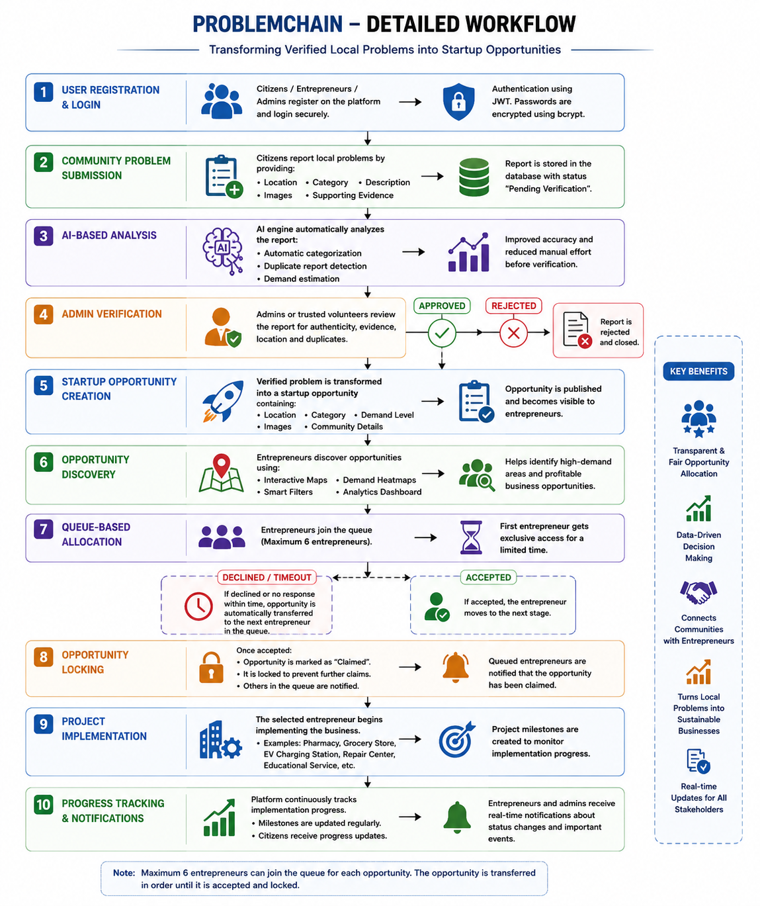
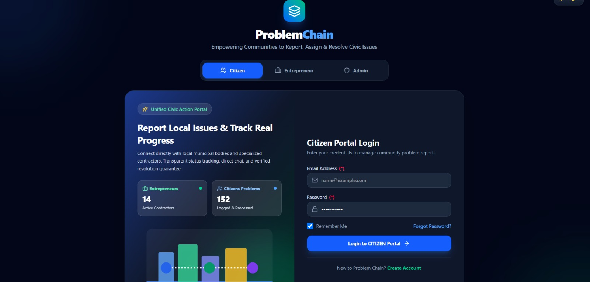
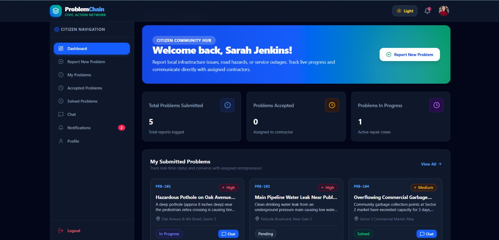
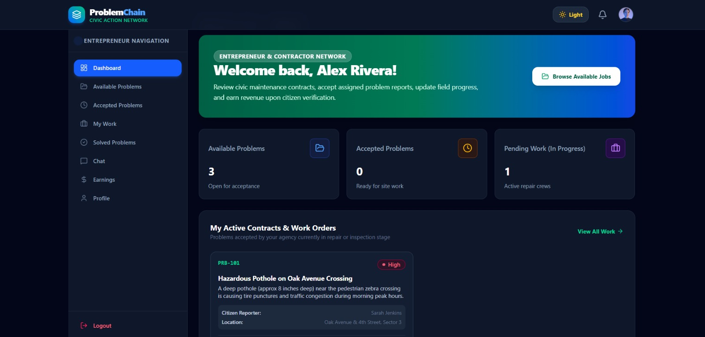
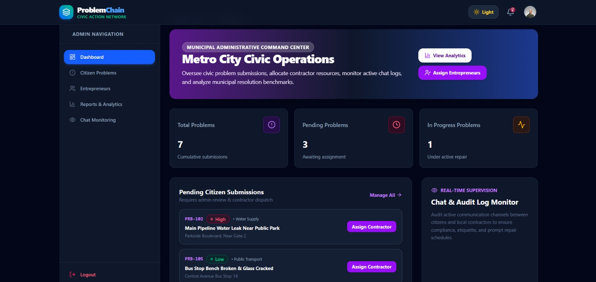

# 🚀 ProblemChain

<div align="center">

# AI-Powered Community Platform for Transforming Verified Local Problems into Startup Opportunities

### 🏆 Domain: Open Innovations

*"Every Verified Community Problem is a Potential Startup Opportunity."*

</div>

---
# 📌 Table of Contents

- Project Overview
- Team Details
- Problem Statement
- Proposed Solution
- Objectives
- Features
- Technology Stack

---

# 🌍 Project Overview

ProblemChain is an AI-powered community platform designed to convert verified local community problems into startup opportunities.

Many communities face problems such as the absence of pharmacies, grocery stores, EV charging stations, repair centers, educational services, healthcare facilities, and other essential businesses. Although these problems affect thousands of people, entrepreneurs often remain unaware of these genuine market demands.

ProblemChain bridges this gap by enabling citizens to report community problems, using Artificial Intelligence to analyze and verify them, and finally transforming verified problems into startup opportunities for entrepreneurs.

The platform creates a transparent ecosystem where citizens, entrepreneurs, administrators, and government authorities collaborate to solve real-world problems while encouraging innovation and economic growth.

---

# 🎯 Domain
**Open Innovation**

---

# 💡 Problem Statement

## Converting Verified Problem into a Startup Solution using AI

Across cities and rural communities, many essential services are unavailable due to the absence of a centralized platform that collects and verifies local community needs.

Citizens frequently experience problems such as:

- No pharmacy nearby
- Lack of grocery stores
- No EV charging station
- No repair centers
- Limited educational services
- Poor healthcare accessibility

Although these problems are genuine, entrepreneurs often fail to identify them as business opportunities.

Current complaint portals only collect complaints.

They **do not convert problems into business opportunities.**

As a result,

- Community problems remain unresolved.
- Entrepreneurs invest without understanding actual demand.
- Governments lack proper regional demand data.
- Economic opportunities are lost.

---

# 🚀 Proposed Solution

ProblemChain provides a complete AI-powered ecosystem for solving this issue.

The platform allows citizens to report verified community problems with supporting evidence.

Artificial Intelligence automatically:

- Categorizes the problem
- Detects duplicate reports
- Estimates community demand

Administrators verify every report before publishing.

Once verified, the problem is converted into a startup opportunity.

Entrepreneurs browse opportunities using maps, analytics, and demand heatmaps.

Interested entrepreneurs join a transparent queue.

The selected entrepreneur starts the business.

The platform continuously tracks implementation progress until the project is completed.

---

# 🎯 Project Objectives

The major objectives of ProblemChain are:

- Create a centralized platform for reporting community problems.
- Verify community reports before publication.
- Use Artificial Intelligence for problem analysis.
- Convert verified problems into startup opportunities.
- Reduce duplicate reports.
- Estimate business demand using AI.
- Connect citizens and entrepreneurs.
- Provide transparent opportunity allocation.
- Enable data-driven business decisions.
- Support sustainable community development.

---

# 👥 Team Details

| S.No | Team Member | Role |
|------|-------------|------------------------------------------------|
| 1 | Saravana | Team Lead, AI/ML Engineer & GitHub Repository Manager |
| 2 | Manoj | Backend Developer |
| 3 | Dharani | Frontend Developer |
| 4 | Sabarish | Research Analyst & Scalability Planner |
| 5 | RONALD REX| QA Engineer & Software Tester |
| 6 | Mohamed Aaseef | Documentation & Presentation Lead |

---

# 🎯 Stakeholders

## 👨‍👩‍👧 Citizens

Citizens can:

- Report local problems
- Upload supporting images
- Track project progress
- Receive notifications

---

## 💼 Entrepreneurs

Entrepreneurs can:

- Browse startup opportunities
- View demand heatmaps
- Join opportunity queues
- Start businesses
- Track implementation

---

## 🛡️ Administrators

Administrators are responsible for:

- Verifying reports
- Managing users
- Managing opportunities
- Monitoring platform activities

---

## 🏛️ Government Authorities

Government authorities can:

- Monitor regional demand
- View analytics
- Support planning
- Improve public services

---

# ✨ Project Features

## 📝 Community Problem Reporting

Citizens submit local problems by providing:

- Location
- Category
- Description
- Images
- Supporting Evidence

---

## 🤖 AI-Based Problem Analysis

Artificial Intelligence automatically performs:

- Problem Categorization
- Duplicate Detection
- Community Demand Estimation

This reduces manual work and improves accuracy.

---

## ✅ Problem Verification

Administrators verify:

- Authenticity
- Evidence
- Location
- Duplicate Status

Only verified reports become startup opportunities.

---

## 🚀 Startup Opportunity Generation

Verified community problems are converted into startup opportunities containing:

- Business Category
- Demand Level
- Location
- Community Information
- Supporting Images

---

## 🗺️ Interactive Maps

Entrepreneurs explore opportunities using:

- Interactive Maps
- Demand Heatmaps
- Smart Filters
- Analytics Dashboard

---

## 📋 Queue-Based Allocation

Queue Rules:

- Maximum 6 Entrepreneurs
- First Come First Served
- Automatic Queue Progression
- Transparent Allocation

---

## 🔒 Opportunity Locking

Once accepted,

- Opportunity becomes Claimed
- Further claims are blocked
- Queue closes automatically

---

## 📈 Project Tracking

The platform tracks:

- Milestones
- Completion Status
- Timeline
- Progress Updates

---

## 🔔 Real-Time Notifications

Notifications are sent to:

- Citizens
- Entrepreneurs
- Administrators

---

## 🌍 Transparent Ecosystem

ProblemChain ensures:

- Verified Reports
- Fair Allocation
- AI Decision Making
- Community Development
- Business Growth

---

# 🛠️ Technology Stack

| Category | Technology |
|----------|------------|
| Frontend | React.js, Vite, HTML5, CSS3, JavaScript |
| UI Framework | Tailwind CSS |
| Backend | Node.js, Express.js |
| Database | MongoDB, Mongoose |
| AI/ML | Python, Scikit-learn, Pandas, NumPy |
| Authentication | JWT, bcrypt |
| Maps | Leaflet.js, OpenStreetMap |
| Image Storage | Cloudinary |
| API Testing | Postman |
| Testing | Jest, Supertest |
| Deployment | Vercel, Render, MongoDB Atlas |
| Version Control | Git & GitHub |

---
# 🏗️ System Workflow

The following diagram illustrates the overall architecture of **ProblemChain**, showing the interaction between users, the frontend, backend, AI/ML modules, database, cloud storage, and external services.

<p align="center">
  
</p>

# 💻 Why ProblemChain?

Unlike traditional complaint portals, ProblemChain does not stop at collecting problems.

Instead, it verifies community needs using Artificial Intelligence and transforms them into profitable startup opportunities. This approach benefits citizens by solving real problems, helps entrepreneurs identify genuine market demand, and supports governments with valuable regional insights for planning and development.


---
# 🏗️ System Architecture

ProblemChain follows a modular and scalable architecture that integrates Artificial Intelligence, modern web technologies, cloud storage, and geospatial visualization. The platform enables seamless communication between citizens, entrepreneurs, administrators, and government authorities while ensuring security, transparency, and efficient data processing.

---

<p align="center">
  
</p>


## 🏛️ Architecture Layers

### 👨‍👩‍👧 User Layer
- Citizens report community problems.
- Entrepreneurs discover startup opportunities.
- Admin verifies reports and manages the platform.

### 🎨 Presentation Layer
Developed using:
- React.js
- Tailwind CSS
- Vite

Provides:
- Responsive UI
- Dashboard
- Maps
- Reports
- Analytics

### ⚙️ Backend Layer

Built using:

- Node.js
- Express.js

Responsibilities:

- Authentication
- Business Logic
- API Management
- Queue Management
- Notification Service
- AI Integration

### 🤖 AI Layer

Artificial Intelligence performs:

- Problem Categorization
- Duplicate Detection
- Demand Estimation

Technologies:

- Python
- Scikit-learn
- Pandas
- NumPy

### 🗄️ Database Layer

MongoDB stores:

- Users
- Reports
- Opportunities
- Queue
- Notifications
- Analytics

### ☁️ Cloud Services

Cloudinary

Stores:

- Images
- Evidence
- Project Photos

---


# 🔄 Detailed Workflow

ProblemChain transforms community problems into startup opportunities through the following workflow.

---

## Step 1 – User Registration

Users register as:

- Citizen
- Entrepreneur
- Administrator

Passwords are securely encrypted using bcrypt.

---

## Step 2 – Community Problem Reporting

Citizens submit:

- Location
- Description
- Images
- Supporting Evidence

Status:

**Pending Verification**

---

## Step 3 – AI Analysis

Artificial Intelligence automatically performs:

- Categorization
- Duplicate Detection
- Demand Estimation

---

## Step 4 – Admin Verification

Admin checks:

- Authenticity
- Location
- Evidence
- Duplicate Reports

If approved,

↓

Moves to Startup Opportunity.

---

## Step 5 – Startup Opportunity Generation

The verified report becomes a startup opportunity containing:

- Business Category
- Demand Level
- Location
- Images

---

## Step 6 – Opportunity Discovery

Entrepreneurs explore opportunities using:

- Maps
- Heatmaps
- Smart Filters
- Analytics Dashboard

---

## Step 7 – Queue Allocation

Queue Rules:

- Maximum 6 Entrepreneurs
- First Come First Served
- Automatic Queue Transfer

---

## Step 8 – Opportunity Locking

When accepted,

- Opportunity becomes Claimed.
- Queue closes.
- Duplicate claims are prevented.

---

## Step 9 – Business Implementation

Examples:

- Pharmacy
- Grocery Store
- EV Charging Station
- Repair Centre
- Educational Service

---

## Step 10 – Progress Tracking

Platform monitors:

- Milestones
- Progress
- Completion Status

Notifications are sent to all stakeholders.

---

## 📌 Workflow Diagram

> **Insert your Workflow Diagram Here**

```text
Citizen Reports Problem
          │
          ▼
AI Analysis
          │
          ▼
Admin Verification
          │
          ▼
Startup Opportunity
          │
          ▼
Entrepreneurs Join Queue
          │
          ▼
Opportunity Allocation
          │
          ▼
Business Implementation
          │
          ▼
Progress Tracking
```

---

# 📁 Project Folder Structure

```text
ProblemChain/
│
├── frontend/
├── backend/
├── ai-engine/
├── docs/
├── tests/
│
├── .env
├── docker-compose.yml
├── README.md
└── LICENSE
```

---

## 📂 Frontend

Contains:

- Components
- Pages
- Services
- Assets
- Routes
- Context
- Hooks

Developed using:

- React.js
- Tailwind CSS
- Vite

---

## ⚙️ Backend

Contains:

- Controllers
- Routes
- Models
- Middleware
- Services
- Configurations

Handles:

- APIs
- Authentication
- Business Logic
- Database Communication

---

## 🤖 AI Engine

Contains:

- ML Models
- Datasets
- Prediction Scripts
- Training Scripts

Performs:

- Categorization
- Duplicate Detection
- Demand Prediction

---

## 📄 Documentation

Includes:

- README
- SRS
- User Guide
- API Documentation

---

## 🧪 Testing

Separate folders for:

- Backend Testing
- Frontend Testing
- API Testing

---

# ⚙️ Installation Guide

## Requirements

- Node.js
- Python
- MongoDB
- Git
- VS Code

---

## Clone Repository

```bash
git clone https://github.com/yourusername/ProblemChain.git

cd ProblemChain
```

---

## Install Frontend

```bash
cd frontend

npm install
```

---

## Install Backend

```bash
cd backend

npm install
```

---

## Install AI Module

```bash
cd ai-engine

pip install -r requirements.txt
```

---

## Configure Environment Variables

Create:

```
backend/.env
```

Example:

```env
PORT=5000

MONGODB_URI=xxxxxxxx

JWT_SECRET=xxxxxxxx

CLOUDINARY_API_KEY=xxxxxxxx
```

---

## Start Backend

```bash
npm run dev
```

---

## Start Frontend

```bash
npm run dev
```

---

## Start AI Engine

```bash
python app.py
```

---

## Open Browser

```
http://localhost:5173
```

---

# 📖 Usage

1. Register
2. Login
3. Report Problem
4. AI Analysis
5. Admin Verification
6. Startup Opportunity Created
7. Entrepreneurs Join Queue
8. Opportunity Allocated
9. Business Started
10. Progress Tracking

---

# 🔌 API Documentation

The frontend communicates with the backend through REST APIs.

---

## Authentication APIs

| Method | Endpoint |
|---------|----------|
| POST | /api/auth/register |
| POST | /api/auth/login |
| GET | /api/auth/profile |

---

## Report APIs

| Method | Endpoint |
|---------|----------|
| POST | /api/reports |
| GET | /api/reports |
| PUT | /api/reports/:id |
| DELETE | /api/reports/:id |

---

## Opportunity APIs

| Method | Endpoint |
|---------|----------|
| GET | /api/opportunities |
| POST | /api/opportunities |
| PUT | /api/opportunities/:id |

---

## Queue APIs

| Method | Endpoint |
|---------|----------|
| POST | /api/queue/join |
| GET | /api/queue/:id |
| PUT | /api/queue/accept/:id |

---

# 🗄️ Database Design

Collections:

- Users
- Reports
- Opportunities
- Queue
- Notifications

---

## Database Workflow

```text
Citizen
   │
   ▼
Reports Collection
   │
   ▼
AI Processing
   │
   ▼
Verification
   │
   ▼
Opportunity Collection
   │
   ▼
Queue Collection
   │
   ▼
Notifications
```

---

## 📌 Part 2 Summary

Part 2 describes the technical implementation of ProblemChain, including its modular architecture, AI-driven workflow, organized folder structure, installation process, REST APIs, and MongoDB database design. These components work together to provide a secure, scalable, and intelligent platform for transforming verified community problems into startup opportunities.

---
# 🔐 Security Measures

ProblemChain is designed with multiple layers of security to protect user data, prevent unauthorized access, and ensure a transparent platform for citizens and entrepreneurs.

---

## 🛡️ Security Features

### 🔑 JWT Authentication
- Secure login for all users.
- Token-based authentication.
- Protected REST APIs.

---

### 🔒 Password Encryption

- Passwords encrypted using **bcrypt**.
- Plain text passwords are never stored.

---

### 👥 Role-Based Access Control (RBAC)

Three different user roles:

- 👨 Citizen
- 💼 Entrepreneur
- 🛡️ Administrator

Each user can access only authorized features.

---

### ☁️ Secure Cloud Storage

Images and supporting evidence are stored securely using **Cloudinary**.

---

### 🗄️ Database Security

MongoDB Atlas provides:

- Authentication
- Secure Connections
- Cloud Backup
- Data Encryption

---

### 🤖 AI Verification

Before publishing,

AI performs:

- Categorization
- Duplicate Detection
- Demand Estimation

Only verified reports become startup opportunities.

---

### 📋 Queue Protection

- Maximum 6 entrepreneurs
- Opportunity Locking
- Automatic Queue Progression

Ensures transparency and fairness.

---

### 🔐 Security Architecture

```text
Users
   │
   ▼
JWT Authentication
   │
   ▼
Role-Based Access
   │
   ▼
Protected REST APIs
   │
   ▼
Business Logic
   │
   ▼
MongoDB + Cloudinary
```

---

# 🧪 Testing & Performance

To ensure quality, ProblemChain follows multiple testing techniques.

---

## Testing Types

### ✅ Unit Testing

Tests:

- Backend Functions
- AI Models

Tools:

- Jest

---

### 🔄 Integration Testing

Checks communication between:

- Frontend ↔ Backend
- Backend ↔ Database
- Backend ↔ AI
- Backend ↔ Cloudinary

---

### 🌐 API Testing

Tools:

- Postman
- Supertest

APIs Tested

- Login
- Registration
- Reports
- Opportunities
- Queue
- Notifications

---

### 💻 UI Testing

Checks:

- Responsiveness
- Navigation
- User Experience

---

### 🔒 Security Testing

Tests:

- JWT Authentication
- Password Encryption
- Role Access
- Protected APIs

---

### ⚡ Performance Testing

Measures:

- API Response Time
- AI Processing
- Database Speed
- Page Loading

---

### 📊 Testing Workflow

```text
Code Development
      │
      ▼
Unit Testing
      │
      ▼
Integration Testing
      │
      ▼
API Testing
      │
      ▼
Security Testing
      │
      ▼
Performance Testing
      │
      ▼
Deployment
```

---

# 🚧 Challenges Faced

During development, several technical challenges were encountered.

---

## 1️⃣ Community Report Verification

Ensuring that reported problems are genuine.

Solution:

- AI Analysis
- Admin Verification

---

## 2️⃣ Duplicate Reports

Multiple users may report the same issue.

Solution:

- AI Duplicate Detection

---

## 3️⃣ Demand Estimation

Estimating actual business demand.

Solution:

- Machine Learning Models
- Location Analysis

---

## 4️⃣ Fair Opportunity Allocation

Providing equal opportunities to entrepreneurs.

Solution:

- Queue-Based Allocation
- Opportunity Locking

---

## 5️⃣ Multi-Technology Integration

Integrating:

- React.js
- Node.js
- MongoDB
- Python
- Cloudinary
- Maps

---

## 6️⃣ Data Scalability

Managing:

- Reports
- Images
- Users
- Opportunities

Solution:

- MongoDB Atlas
- Cloud Storage

---

# 🔮 Future Scope

ProblemChain can be expanded with many advanced features.

---

## 📱 Mobile Application

Develop Android & iOS applications.

---

## 🤖 Advanced AI

Use:

- NLP
- Deep Learning
- Better Recommendations

---

## 🏛️ Government Integration

Connect with

- Smart City Projects
- Municipal Portals

---

## 🌍 Multilingual Support

Support:

- English
- Tamil
- Hindi
- Telugu
- Malayalam

---

## 📊 Predictive Analytics

Predict future business demand.

---

## 🗺️ Advanced GIS

Add:

- Live Heatmaps
- Smart Analytics
- Satellite Maps

---

## ☁️ Cloud Deployment

Future deployment using:

- Docker
- Kubernetes
- Microservices

---

# 🚀 Future Roadmap

```text
Current Platform
        │
        ▼
Mobile Application
        │
        ▼
Advanced AI
        │
        ▼
Government Integration
        │
        ▼
Predictive Analytics
        │
        ▼
Cloud Deployment
        │
        ▼
Global Community Platform
```

---

# 📚 References

## Books

- Software Engineering – Ian Sommerville
- Clean Architecture – Robert C. Martin
- Learning React – Alex Banks
- MongoDB: The Definitive Guide
- Hands-On Machine Learning – Aurélien Géron

---

## Official Documentation

- React
- Node.js
- Express.js
- MongoDB
- Tailwind CSS
- Leaflet.js
- Cloudinary
- JWT
- Scikit-learn
- Pandas
- NumPy

---

## Development Tools

- Visual Studio Code
- Git
- GitHub
- MongoDB Atlas
- Postman
- Render
- Vercel
- Canva

---


## 📸 Demo

### Login Page

<p align="center">
  
</p>


### 👤 Citizen Dashboard

<p align="center">
  
</p>

## 💼 Entrepreneur Dashboard

<p align="center">
  
</p>

## 🛡️ Admin Dashboard

<p align="center">
  
</p>


# 🎯 Conclusion

ProblemChain is an AI-powered platform that transforms verified community problems into startup opportunities. By combining Artificial Intelligence, secure web technologies, interactive maps, and transparent opportunity allocation, the platform creates value for citizens, entrepreneurs, and government authorities.

Instead of simply collecting complaints, ProblemChain identifies genuine community needs and converts them into sustainable business opportunities, promoting innovation, entrepreneurship, and economic development.

---

# 🌍 Project Impact

### 👨 Citizens

- Community problems get solved.
- Transparent progress tracking.

### 💼 Entrepreneurs

- Verified business opportunities.
- Reduced investment risk.
- Real demand before investing.

### 🏛️ Government

- Regional demand analytics.
- Better planning.
- Community development.

---

# 🙏 Acknowledgement

We sincerely thank our mentors, faculty members, hackathon organizers, judges, and the open-source community for their valuable guidance and support throughout the development of **ProblemChain**.

We also thank the developers of React.js, Node.js, MongoDB, Python, and other open-source technologies that made this project possible.

---

# 👨‍💻 Developed By

## Team ProblemChain

| Member | Responsibility |
|---------|----------------|
| Saravana | Team Lead, AI/ML Engineer & GitHub Manager |
| Manoj | Backend Developer |
| Dharani | Frontend Developer |
| Sabarish | Research Analyst & Scalability Planner |
| Ronald | QA Engineer & Software Tester |
| Aaseef | Documentation & Presentation Lead |

---

<div align="center">

# ⭐ ProblemChain

### **AI-Powered Community Platform for Transforming Verified Local Problems into Startup Opportunities**

### 🚀 "Every Verified Community Problem is a Potential Startup Opportunity."

**Made with ❤️ by Team ProblemChain**

</div>
