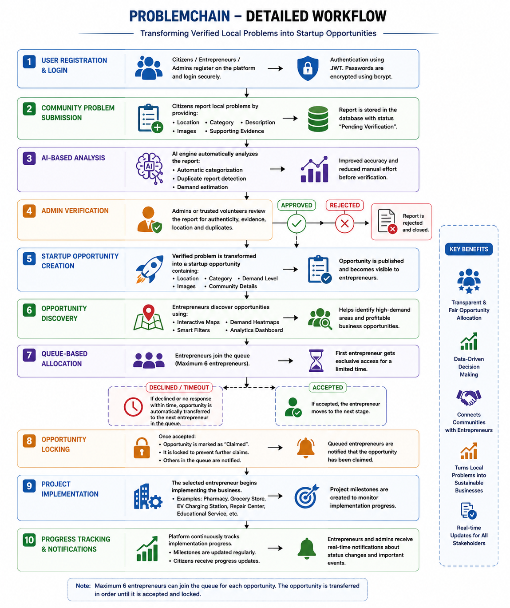
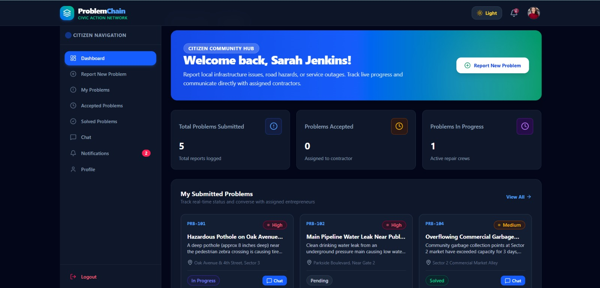
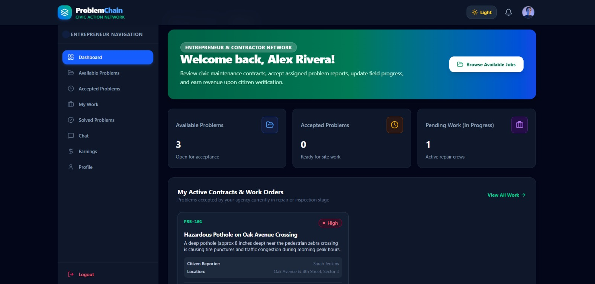
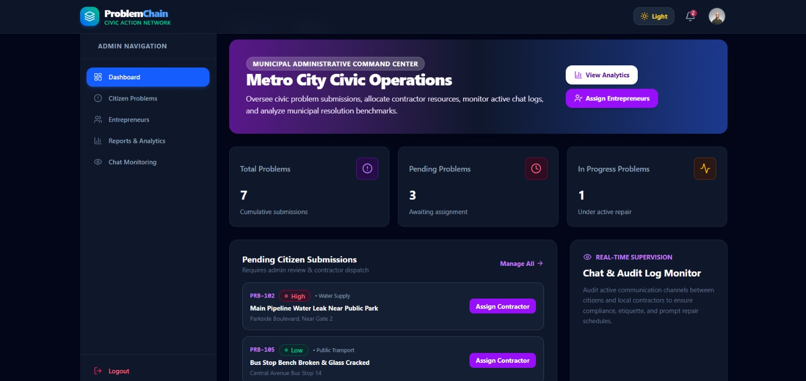
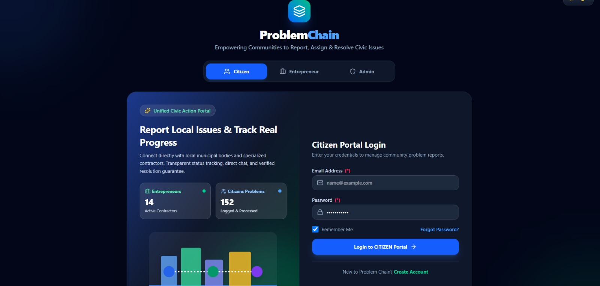

# 🚀 ProblemChain

> ℹ️ **Hackathon Prototype Notice**: ProblemChain was developed as an open-innovation civic prototype during the **Rush Hour 2026 Hackathon**. This repository contains both the consolidated production-buildable TypeScript full-stack application on branch `main` and the historical competition sprint archive on branch `Test`.

<div align="center">

[](https://github.com/RONALD-REX-7/RUSH_HOUR_2026/actions/workflows/ci.yml)
[](./LICENSE)
[](https://www.typescriptlang.org/)
[](https://react.dev/)
[](https://tailwindcss.com/)
[](https://expressjs.com/)

### AI-Powered Civic Issue Verification & Startup Opportunity Ecosystem

*"Transforming Verified Community Needs into Viable Local Startup Opportunities."*

</div>

---

## 📌 Table of Contents

1. [Project Overview](#-project-overview)
2. [Hackathon Team & Roles](#-hackathon-team--roles)
3. [Problem Statement & Solution](#-problem-statement--solution)
4. [Engineering Reality & Implementation Matrix](#-engineering-reality--implementation-matrix)
5. [System Architecture & Visual Workflows](#-system-architecture--visual-workflows)
6. [Interactive Application Dashboards](#-interactive-application-dashboards)
7. [Repository File Tree](#-repository-file-tree)
8. [REST API Documentation](#-rest-api-documentation)
9. [Local Reproduction & Quickstart](#-local-reproduction--quickstart)
10. [Hygiene, Security & Licensing](#-hygiene-security--licensing)

---

## 🌍 Project Overview

Across urban and rural communities, residents frequently face acute, unmet civic and infrastructural needs: absence of pharmacies, lack of grocery stores, missing EV charging stations, unpaved roads, broken water mains, and insufficient local services. While these issues severely affect residents, aspiring local entrepreneurs struggle to obtain verified market demand data to justify opening new businesses in those specific locations.

Traditional civic portals act merely as complaint receptacles without converting verified demand into economic initiatives.

**ProblemChain** bridges this gap:
1. **Citizens** submit localized problems with descriptions, priority levels, and photographic evidence.
2. **Administrators** verify authentic reports, filter duplicates, and convert issues into actionable startup opportunities.
3. **Entrepreneurs** discover verified demand via geographic density heatmaps, join a transparent allocation queue, accept contracts, and track resolution earnings.
4. **Stakeholders** collaborate through integrated role-based messaging and progress monitoring.

---

## 👥 Hackathon Team & Roles

Developed during the **Rush Hour 2026 Hackathon** by a cross-functional engineering team:

| Member | Role | Responsibilities | Sprint Branch |
| :--- | :--- | :--- | :--- |
| [**Saravanakumar G**](https://github.com/saravana5632) | Team Lead, AI/ML Engineer & Repo Manager | Architecture leadership, AI categorization pipelines, PR reviews | `AIML` |
| **Ronald Rex C H** ([@RONALD-REX-7](https://github.com/RONALD-REX-7)) | QA Engineer & Software Tester | Functional/integration testing, CI pipeline, code audits, type verification | `main` / `testing` |
| **Manoj** | Backend Developer | Express REST APIs, authentication, MongoDB models, database integration | `Backend` |
| **Dharani** | Frontend Developer | React UI components, responsive layout, client API consumption | `Frontend` |
| **Aaseef** | Documentation & Presentation Lead | Project documentation, README maintenance, slide deck, user guides | `Docs` |
| **Sabarish** | Research Analyst & Scalability Planner | Market demand research, scalability models, technical architecture | `Research` |

---

## 💡 Problem Statement & Solution

```
   [Citizen Reports Issue] ──> [Evidence & Geolocation]
                                       │
                                       ▼
                         [Admin Verification Gate]
                                       │
                                       ▼
                       [Startup Opportunity Published]
                                       │
                                       ▼
                     [Entrepreneurs Browse Demand Map]
                                       │
                                       ▼
                     [Queue-Based Contract Allocation]
                                       │
                                       ▼
                    [Implementation & Progress Tracking]
                                       │
                                       ▼
                     [Citizen Rating & Project Sign-off]
```

---

## 🔍 Engineering Reality & Implementation Matrix

To maintain engineering transparency, the table below documents the delta between the initial hackathon sprint design proposal (`Details/Tech Stack.pdf`) and the actual implementation in this repository:

| Capability | Hackathon Proposal | Implemented Codebase | Technical Verification Notes |
| :--- | :--- | :--- | :--- |
| **Frontend Framework** | React.js + Vite | React 19.0.1 + Vite 6.2.3 + TypeScript 5.8 | Full TypeScript client SPA with strict types. |
| **Styling** | Tailwind CSS | Tailwind CSS v4.1.14 via `@tailwindcss/vite` | Modern utility styling with dark-mode support. |
| **Geospatial Maps** | Leaflet.js + OpenStreetMap | SVG TopoJSON via `react-simple-maps` | World Atlas 110m projection with interactive issue density color-coding and popup modals. |
| **Backend Runtime** | Node.js + Express.js | Node.js 22 + Express 4.21.2 (TypeScript) | Dual-mode Express server serving REST APIs and Vite middleware. |
| **Database** | MongoDB Atlas | MongoDB Mongoose 9.8 + Resilient In-Memory Fallback | Fully connects to MongoDB when `MONGODB_URI` is set; automatically falls back to an in-memory mock store for zero-dependency local runs. |
| **Authentication** | JWT + bcrypt | `jsonwebtoken` 9.0 + `bcryptjs` 3.0 | Secure password hashing on registration, Bearer token verification, and role-based route middleware. |
| **Image Storage** | Cloudinary | In-Memory / Base64 Data URLs | Hackathon proposal planned Cloudinary; implemented prototype embeds data URLs directly into problem records to avoid external API dependencies. |
| **Testing & CI** | Jest + Supertest | `tsc --noEmit` + Vite/esbuild Bundle Gate | GitHub Actions workflow validates TypeScript types and production builds on push/PR. |

---

## 🏗️ System Architecture & Visual Workflows

### System Architecture
The platform follows a layered client-server architecture with role-based routing, unified API controllers, and resilient persistence:

<p align="center">
  
</p>

### End-to-End Operational Workflow
The lifecycle of an issue from citizen submission to entrepreneur execution and administrative oversight:

<p align="center">
  
</p>

---

## 💻 Interactive Application Dashboards

ProblemChain provides tailored role-based portals for all three system actors:

### 1. Citizen Portal
Enables citizens to file geotagged infrastructure reports, attach photos, inspect problem status, and communicate directly with assigned entrepreneurs:

<p align="center">
  
</p>

### 2. Entrepreneur Portal
Allows entrepreneurs to browse open civic opportunities, view regional demand density, claim contracts, submit milestone updates, and track monthly earnings:

<p align="center">
  
</p>

### 3. Administrator Portal
Provides comprehensive administrative oversight: reviewing reported issues, verifying evidence, assigning entrepreneurs, inspecting platform analytics, and monitoring chat channels:

<p align="center">
  
</p>

### 4. Authentication Shell
Role-based authentication interface supporting seamless switching between Citizen, Entrepreneur, and Administrator profiles:

<p align="center">
  
</p>

---

## 📁 Repository File Tree

```text
RUSH_HOUR_2026/
├── .github/
│   └── workflows/
│       └── ci.yml               # GitHub Actions CI workflow (Node 22, typecheck, build)
├── Details/                     # Authentic hackathon artifacts, diagrams, and sprint specifications
│   ├── System Architecture.jpeg # Architectural blueprint
│   ├── workflow.png             # Operational workflow diagram
│   ├── citizen_dashboard.jpeg   # Citizen UI mockup
│   ├── entrepreneur_dashboard.jpeg # Entrepreneur UI mockup
│   ├── admin_dashboard.jpeg     # Admin analytics mockup
│   ├── login_page.jpeg          # Authentication UI mockup
│   ├── Project Details.pdf      # Original hackathon project specification
│   ├── Team Roles.pdf           # Team assignment and branch mapping
│   └── Tech Stack.pdf           # Sprint technical proposal
├── server/                      # Express.js backend services (TypeScript)
│   ├── config/                  # Mongoose connection settings
│   ├── controllers/             # Auth request controllers
│   ├── middleware/              # JWT auth and central error handling middleware
│   ├── models/                  # Mongoose data schemas (User, Problem, Chat, Notification)
│   ├── routes/                  # Express REST routes (/api and /api/secure-auth)
│   ├── services/                # Business logic and bcrypt password hashing
│   └── db.ts                    # Dual-mode data layer: live MongoDB with in-memory fallback
├── src/                         # React 19 Frontend (SPA)
│   ├── components/
│   │   ├── admin/               # Admin overview, problem queue, chat monitoring, analytics
│   │   ├── auth/                # Login page with role-selector
│   │   ├── chat/                # Real-time styled messaging interface
│   │   ├── citizen/             # Issue reporting form, issue history, chat view
│   │   ├── common/              # Notifications drawer, user profile management
│   │   ├── entrepreneur/        # Opportunity list, active work, solved tasks, earnings
│   │   ├── layout/              # Responsive navbar, collapsible sidebar, breadcrumbs
│   │   └── ui/                  # Reusable UI tokens (LocationMap, Badge, Modal, StatCard)
│   ├── context/                 # Central React AppContext state store
│   ├── data/                    # Seed mock datasets & geographic coordinate tables
│   ├── services/                # Axios API client integrations
│   ├── types/                   # Strict TypeScript domain interfaces
│   ├── App.tsx                  # Root layout orchestration and view switching
│   ├── main.tsx                 # Client application entrypoint
│   └── index.css                # Tailwind CSS v4 styling tokens
├── server.ts                    # Full-stack server entry (Express API + Vite SPA serving)
├── package.json                 # Project configuration & npm scripts
├── tsconfig.json                # TypeScript compiler configuration
├── vite.config.ts               # Vite configuration with React & Tailwind plugins
├── index.html                   # HTML entrypoint
├── LICENSE                      # Apache License 2.0
├── SECURITY.md                  # Vulnerability disclosure policy
├── CONTRIBUTING.md              # Contributor workflow and verification guide
└── .env.example                 # Environment variables placeholder template
```

---

## 🔌 REST API Documentation

The Express server exposes the following REST API endpoints:

### System & Health
| Method | Endpoint | Description |
| :--- | :--- | :--- |
| `GET` | `/api/health` | System health check and database mode status (`MongoDB` or `Memory Store`). |

### Authentication
| Method | Endpoint | Description |
| :--- | :--- | :--- |
| `POST` | `/api/auth/login` | Fast prototype login by role and optional email; returns JWT token. |
| `GET` | `/api/auth/me` | Returns authenticated user profile via Bearer JWT header. |
| `POST` | `/api/secure-auth/register` | Mongoose/bcrypt registration with salted password hashing. |
| `POST` | `/api/secure-auth/login` | Mongoose/bcrypt login with credential verification. |
| `GET` | `/api/secure-auth/profile` | Protected profile route secured by JWT middleware. |

### Problems & Civic Opportunities
| Method | Endpoint | Description |
| :--- | :--- | :--- |
| `GET` | `/api/problems` | Fetch all civic problems. |
| `POST` | `/api/problems` | Submit a new problem report with category, location, and images. |
| `PUT` | `/api/problems/:id` | Update an existing problem record. |
| `DELETE` | `/api/problems/:id` | Delete a problem record by ID. |
| `POST` | `/api/problems/:id/assign` | Assign an entrepreneur to an active problem contract. |
| `POST` | `/api/problems/:id/rating` | Citizen submits star rating and feedback on a solved problem. |

### Collaboration & Messaging
| Method | Endpoint | Description |
| :--- | :--- | :--- |
| `GET` | `/api/chats` | Retrieve chat messages across problems. |
| `POST` | `/api/chats` | Post a new message with optional attachment metadata. |
| `GET` | `/api/notifications` | Retrieve notifications for the active user. |
| `PUT` | `/api/notifications/:id/read` | Mark a specific notification as read. |
| `PUT` | `/api/notifications/user/:userId/read-all` | Mark all user notifications as read. |

---

## ⚙️ Local Reproduction & Quickstart

### Prerequisites
- **Node.js**: `>= 20.0.0` (Node 22 recommended)
- **npm**: `>= 10.0.0`
- *(Optional)* **MongoDB**: Local or Atlas instance. If omitted, the server automatically runs in zero-dependency **In-Memory Mock Store Mode**.

### Quickstart Steps

```bash
# 1. Clone the repository
git clone https://github.com/RONALD-REX-7/RUSH_HOUR_2026.git
cd RUSH_HOUR_2026

# 2. Install dependencies
npm install

# 3. Verify static type analysis
npm run lint

# 4. Verify production bundling
npm run build

# 5. Launch the full-stack server
npm run dev
```

The server will launch on `http://localhost:3000`. Open your browser to access the complete application.

### Environment Configuration (Optional)
To run against a live MongoDB database, create a `.env` file in the root directory:

```env
PORT=3000
MONGODB_URI=mongodb://localhost:27017/problemchain
JWT_SECRET=your_custom_jwt_secret_key
```

---

## 🛡️ Hygiene, Security & Licensing

- **License**: Released under the **Apache License 2.0**. See [`LICENSE`](./LICENSE) for terms.
- **Security Policy**: See [`SECURITY.md`](./SECURITY.md) for vulnerability disclosure guidelines.
- **Contributing**: Development guidelines and branch governance are outlined in [`CONTRIBUTING.md`](./CONTRIBUTING.md).
- **Branch Notice**: The default branch is `main`. Branch `Test` is preserved as an archive of the raw hackathon multi-directory submission.
